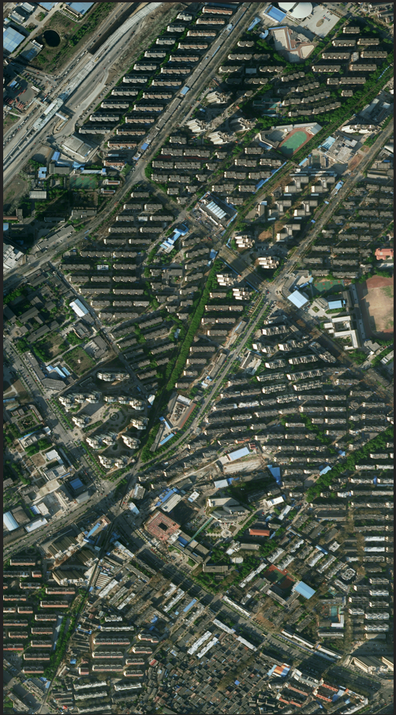
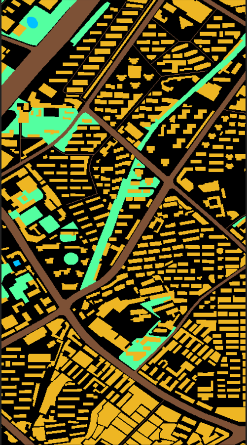
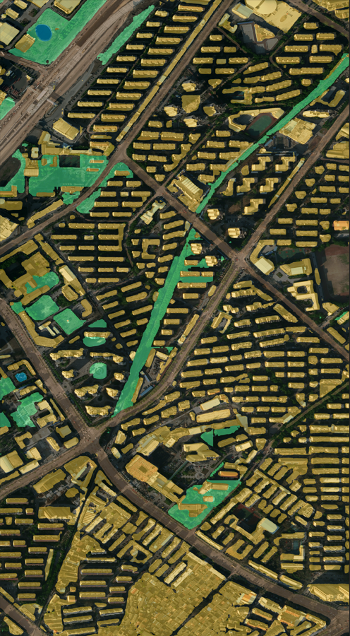

# A Semantic Segmentation Skeleton code and Tool  For Remote Sensing--PyTorch

## TODO:
   - [ ] 总结训练步骤、技巧
   - [ ] 分享预训练模型

## 分割结果展示

|  |  |  |
| :----------------------: | :------------------------: | :--------------------------: |
|         **Img**          |           **GT**           |           **Pre**            |

## 使用TensorBoard查看各项指标以及可视化（img, GT, Pre）
    tensorboard --logdir=<your_log_dir> or 绝对路径
    (base) E:\project\china_sourth_pytorch>tensorboard --logdir tensorboard

## 数据分享

- [**百度网盘链接**](https://pan.baidu.com/s/18LzxOHnxKXTW6wx-FKOw2g)  (提取码vwof)
  
- ##### [GID ](https://arxiv.org/abs/1807.05713)[官方下载链接](https://x-ytong.github.io/project/GID.html)
  
    

## Reference

​        vis2gray.py转换颜色标签为数字标签

​		sliding_cut_for_train.py 裁切影像

​		predict.py 进行全图预测

​		palette.py 标签可视化

​    

## Contact

​    